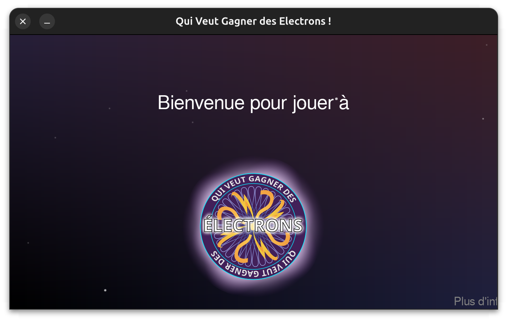

# Qui veut gagner des électrons

C'est un jeu codé en python, avec pygame et numpy, dont le but est de répondre a quelques questions concernant le projet "clairvolt".
Il s'agit d'un projet de quartier visant à permettre aux personnes du lotissement de faire une installation photovoltaïque en location attribution.
Plus d'infos sur https://clairvolt.fr .

Pour démarrer le jeu, il suffit de lancer un terminal et de faire: `python3 main.py`.
Et pour jouer en "plein écran": `python3 main.py -f`.